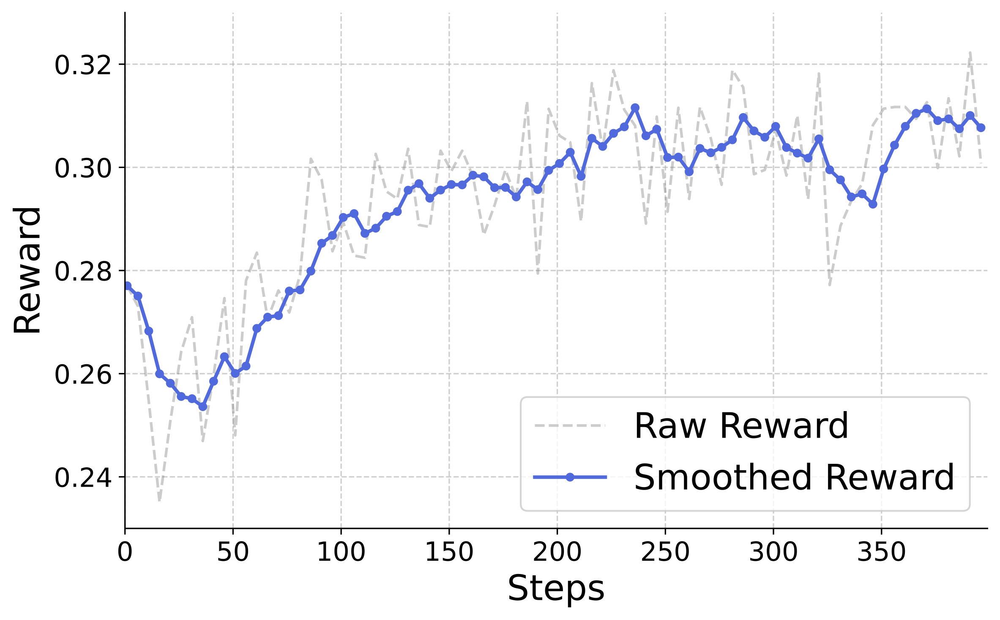

# SimpleAR: Pushing the Frontier of Autoregressive Visual Generation

<div style="text-align: center; margin-top: 0px;">
  <a href="" target="_blank" style="text-decoration: none; color: #007acc;">
    SimpleAR: Pushing the Frontier of Autoregressive Visual Generation through Pretraining, SFT, and RL
  </a><br><br>
  Junke Wang<sup>1</sup>, Zhi Tian<sup>2</sup>, Xun Wang<sup>2</sup>, Xinyu Zhang<sup>2</sup>, Weilin Huang<sup>2</sup>, Zuxuan Wu<sup>1</sup>, Yu-Gang Jiang<sup>1</sup><br>
  <sup>1</sup>Fudan University, <sup>2</sup>ByteDance Seed
  <br>
</div>

<br>

<a style="display: block; text-align: center; margin-top: 20px;"></a>

## Introduction

This paper presents SimpleAR, a vanilla autoregressive visual generation model that achieves state-of-the-art performance. First the first time, we demonstrate that:
- 🏆 with only 0.5B parameters, an AR model can generate 1024 resolution images with high fidelity, and achieve competitive results on challenging text-to-image benchmarks, e.g., 0.59 on GenEval and 79.66 on DPG;
- 🚀 both supervised fine-tuning (SFT) and Group Relative Policy Optimization (GRPO) training could lead to significant improvements on image aesthectics and prompt alignment;
- ⚡️ when deployed with vLLM, the throughput of AR model allows for generating 1024 resolution images in 14 seconds, making high-resolution generation practical for real-world applications. 

We open-sourced all the training and inference code, hoping to show the potential of autoregressive visual generation and encourage more participation in this research field.

## Models & Scripts

### Installation

Please follow the instructions below to install the environment:

```bash
python3 -m venv env

source env/bin/activate

pip install -e ".[train]"

cd transformers

pip install -e .

cd ..
```

## Model Zoo

We provide both SFT checkpoints and RL checkpoints:

| name | GenEval | DPG | HF weights 🤗 |
|:---|:---:|:---:|:---:|
| SimpleAR-0.5B-sft | 0.53 | 79.34 | [0.5B-sft](https://huggingface.co/Daniel0724/SimpleAR/tree/main/simplear_0.5B_sft) |
| SimpleAR-0.5B-rl | 0.59 | 79.66 | [0.5B-grpo](https://huggingface.co/Daniel0724/SimpleAR/tree/main/simplear_0.5B_rl) |
| SimpleAR-1.5B-sft | 0.61 | 80.11 | [1.5B-sft](https://huggingface.co/Daniel0724/SimpleAR/tree/main/simplear_1.5B_sft) |
| SimpleAR-1.5B-rl | 0.63 | 81.31 | [1.5B-grpo](https://huggingface.co/Daniel0724/SimpleAR/tree/main/simplear_1.5B_rl) |

Besides, we use [Cosmos](https://huggingface.co/nvidia/Cosmos-1.0-Tokenizer-DV8x16x16) as our visual tokenizer, you can download and put it under *./checkpoints/*:

```bash
cd checkpoints

git lfs install

git clone https://huggingface.co/nvidia/Cosmos-1.0-Tokenizer-DV8x16x16
```

## Training

### Data Preparation

We cache the visual tokens for efficient training. Below is the command to extract visual tokens with Cosmos Tokenizer:

```bash
torchrun \
--nnodes=1 --nproc_per_node=8 \
simpar/data/extract_token.py \
    --dataset_type "image" \
    --dataset_name "example" \
    --code_path "/path_to_saved_tokens" \
    --gen_data_path "/path_to_meta_json" \
    --gen_resolution 1024
```

You can specify the meta data file with *--gen_data_path*, which should be a json file with the following format:

```
{
  "image_path": "path_to_image",
  "caption": "a photo of a cat"
}
```

After this, you can use *./scripts/tokens/generate_meta.py* to prepare a meta file.

### Pretrain and SFT

For both pretraining and SFT, we use the following command to train the model:

```bash
ACCELERATE_CPU_AFFINITY=1 \
torchrun \
    --nnodes=4 \
    --nproc_per_node=8 \
    llava/train/train_mem.py \
    --deepspeed scripts/zero3.json \
    --model_name_or_path "/path_to_your_dir/Qwen2.5-0.5B-Instruct" \
    --version "qwen_1_5" \
    --gen_data_path /path_to_annotation_file \
    --gen_image_folder "" \
    --sample_short True \
    --mm_tunable_parts="mm_language_model" \
    --p_drop_cond 0.1 \
    --mm_use_im_start_end False \
    --mm_use_im_patch_token False \
    --mm_patch_merge_type spatial_unpad \
    --bf16 True \
    --run_name test \
    --output_dir /path_to_output_dir \
    --num_train_epochs 1 \
    --per_device_train_batch_size 8 \
    --per_device_eval_batch_size 1 \
    --gradient_accumulation_steps 2 \
    --evaluation_strategy "no" \
    --save_strategy "steps" \
    --save_steps 5000 \
    --learning_rate 1e-4 \
    --weight_decay 0.01 \
    --warmup_ratio 0.0 \
    --lr_scheduler_type "constant" \
    --logging_steps 1 \
    --tf32 True \
    --model_max_length 1536 \
    --dataloader_num_workers 16 \
    --lazy_preprocess True \
    --torch_compile True \
    --torch_compile_backend "inductor" \
    --dataloader_drop_last True \
    --report_to wandb \
    --attn_implementation sdpa
```

We set *--model_max_length* to # of visual tokens + 512, i.e., 1536 for 512 pretraining and 4608 for 1024 SFT.

### GRPO

We follow [Open-R1](https://github.com/huggingface/open-r1) to implement GRPO training with [trl](https://github.com/huggingface/trl), please refer to *./scripts/env_rl.sh* to set up the environment. Then you can run:

```bash
accelerate launch --main_process_port 1234 --config_file llava/configs/accelerate_configs/zero3.yaml \
    --num_processes=7 llava/train/llava_trainer_grpo.py \
    --config llava/configs/config_grpo.yaml \
    --data_path /path_to_annotation_file
```

During training, we observed quite promising reward curves😄:
<br>

<a style="display: block; text-align: left; margin-top: 10px;"></a>


## Evaluation and Inference

### Benchmark Evaluation 

We provide the scripts to evaluate our model on [GenEval](https://github.com/djghosh13/geneval) and [DPG-Bench](https://github.com/TencentQQGYLab/ELLA/tree/main/dpg_bench) under *./scripts/eval*:

```bash
CUDA_VISIBLE_DEVICES=0,1,2,3,4,5,6,7 bash scripts/eval/bench_dpg.sh
```

Please follow the instructions in their repo to calculate the metrics.

### Inference with vLLM and SJD

vLLM could significantly improve the inference efficiency, you can first install ite from [this repo](https://github.com/wdrink/vllm):

```
git clone https://github.com/wdrink/vllm

cd vllm

pip install -e .

cd ..

mv vllm vllm_local

mv vllm_local/vllm ./
```

then pass *--vllm_serving* in the evaluation script to try vLLM.

We also implement [speculative jacobi decoding (SJD)](https://arxiv.org/abs/2302.01318), you can try it with *--sjd_sampling*.

### Play with Our Model

You can play with SimpleAR with the following command:

```
python3 generate.py
```

## Visualizations

<p align="left">
  
  
  <br>
  <em>1024 x 1024 generation results by SimpleAR.</em>
</p>

## Citation
If you find this repository helpful, please consider citing:
```bib
@article{wang2025simplear,
    title={SimpleAR: Pushing the Frontier of Autoregressive Visual Generation through Pretraining, SFT, and RL},
    author={Wang, Junke and Tian, Zhi and Wang, Xun and Zhang, Xinyu and Huang, Weilin and Wu, Zuxuan and Jiang, Yu-Gang},
    journal={arXiv preprint arXiv:2504.11455},
    year={2025}
}
```
